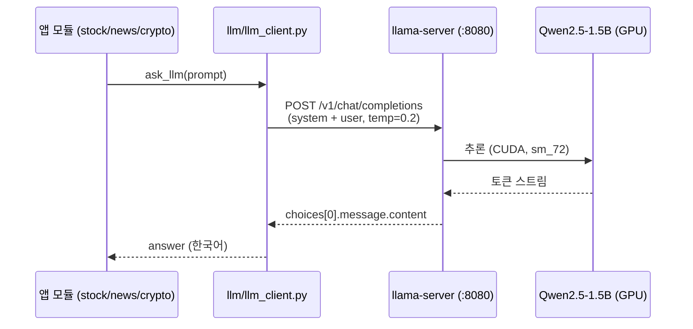

# 시리즈 #01 — 로컬 LLM 서빙 (llama.cpp on Jetson Xavier NX)

Jetson Xavier NX 한 대에서 클라우드 API 없이 LLM을 직접 서빙하는 셋업입니다. `llama.cpp` 를 CUDA로 빌드해 `llama-server` 로 OpenAI 호환 API를 열고, 프로젝트의 모든 모듈이 이 하나의 엔드포인트를 공유합니다.

---

## 개요

작은 엣지 디바이스(6.8GB 공유 메모리)에서 실시간에 가깝게 응답하는 게 목표였습니다. 그래서 선택한 조합은:

- **모델**: Qwen2.5-1.5B-Instruct — 한국어 품질 대비 크기가 작고, 요약·간단 분석에 충분
- **양자화**: Q4_K_M (GGUF) — 정확도 손실을 최소화하면서 메모리 절감
- **서빙**: llama.cpp의 `llama-server` — OpenAI 호환 `/v1/chat/completions` 제공
- **운영**: systemd 로 상시 구동(Restart=always)

## 실행 환경

| 구분 | 값 |
|---|---|
| 보드 | NVIDIA Jetson Xavier NX Developer Kit |
| 아키텍처 | aarch64, GPU compute capability **7.2 (sm_72)** |
| OS | L4T R35.6.4 (JetPack 5.x), kernel 5.10.x-tegra |
| CUDA | 11.4 |
| 메모리 | 6.7GB 통합 메모리(CPU/GPU 공유), GPU 가용 약 6.8GB |
| llama.cpp | GGML_CUDA=ON 빌드 (server build b97ebdc98) |

> Xavier는 통합 메모리 구조라 VRAM이 시스템 RAM과 공유됩니다. 모델·컨텍스트·OS가 6.8GB를 나눠 쓰므로 **모델 크기 선택이 곧 안정성**입니다.

## 요청 흐름



## 1. 모델 선정

Xavier의 메모리 예산 안에서 후보 두 개를 받아 비교했습니다.

| 모델 | 양자화 | 파일 크기 | 비고 |
|---|---|---|---|
| Qwen2.5-1.5B-Instruct | Q4_K_M | ~1.1 GB | **채택** — 응답 지연이 낮고 6.8GB에 여유 |
| Qwen2.5-3B-Instruct | Q4_K_M | ~2.0 GB | 품질은 낫지만 컨텍스트 확보 시 메모리 빠듯 |

1.5B로도 뉴스 요약과 종목 코멘트 수준에는 충분했고, 3B는 백업으로 보관만 합니다. GGUF는 Hugging Face의 Qwen2.5 GGUF 배포본에서 받아 `~/models/` 에 두었습니다.

```bash
# 예시: GGUF 다운로드 후 배치
mkdir -p ~/models
# huggingface-cli 또는 wget 으로 qwen2.5-1.5b-instruct-q4_k_m.gguf 받기
ls ~/models
# qwen2.5-1.5b-instruct-q4_k_m.gguf
# qwen2.5-3b-instruct-q4_k_m.gguf
```

## 2. llama.cpp CUDA 빌드

Jetson에서는 CUDA 가속을 켜는 게 핵심입니다. compute capability 7.2 이므로 `CMAKE_CUDA_ARCHITECTURES=72` 를 명시합니다.

```bash
git clone https://github.com/ggml-org/llama.cpp
cd llama.cpp

cmake -B build \
  -DGGML_CUDA=ON \
  -DCMAKE_CUDA_ARCHITECTURES=72

cmake --build build --config Release -j"$(nproc)"
```

빌드가 끝나면 서버가 GPU를 잡는지 버전 출력으로 확인합니다.

```bash
./build/bin/llama-server --version
# ggml_cuda_init: found 1 CUDA devices ...
#   Device 0: Xavier, compute capability 7.2, VMM: yes, VRAM: 6833 MiB
```

## 3. 서버 실행

수동 실행 커맨드는 다음과 같습니다. `-c` 컨텍스트, `-b` 배치, `-np` 병렬 슬롯을 Xavier 메모리에 맞춰 보수적으로 잡았습니다.

```bash
~/llama.cpp/build/bin/llama-server \
  -m ~/models/qwen2.5-1.5b-instruct-q4_k_m.gguf \
  -c 2048 \
  -np 1 \
  -b 256 \
  --host 0.0.0.0 \
  --port 8080
```

| 옵션 | 값 | 이유 |
|---|---|---|
| `-c` (context) | 2048 | 요약/분석 프롬프트에 충분, 메모리 절약 |
| `-np` (parallel) | 1 | 단일 사용자, 슬롯 1개로 메모리 집중 |
| `-b` (batch) | 256 | Xavier 대역폭에 맞춘 보수적 배치 |
| `--host` | 0.0.0.0 | 로컬 + 동일 네트워크 접근 허용 |

## 4. systemd 상시 구동

부팅 시 자동 실행 + 죽으면 자동 재시작을 위해 `systemd` 서비스로 등록합니다.

```ini
# /etc/systemd/system/llama.service
[Unit]
Description=Llama Server
After=network.target

[Service]
User=user
WorkingDirectory=/home/user/llama.cpp
ExecStart=/home/user/llama.cpp/build/bin/llama-server \
  -m /home/user/models/qwen2.5-1.5b-instruct-q4_k_m.gguf \
  -c 2048 -np 1 -b 256 --host 0.0.0.0 --port 8080
Restart=always
RestartSec=10

[Install]
WantedBy=multi-user.target
```

```bash
sudo systemctl daemon-reload
sudo systemctl enable --now llama.service
systemctl status llama.service   # active (running) 확인
```

## 5. 애플리케이션 연동

서버가 OpenAI 호환이므로 클라이언트는 단순한 HTTP POST 한 번입니다. 페르소나와 답변 규칙은 시스템 프롬프트로 분리했습니다.

```python
# llm/llm_client.py
import requests

LLM_URL = "http://127.0.0.1:8080/v1/chat/completions"

with open("/home/user/xavier_nx_ai/llm/system_prompt.txt", encoding="utf-8") as f:
    system_prompt = f.read()

def ask_llm(prompt):
    payload = {
        "messages": [
            {"role": "system", "content": system_prompt},
            {"role": "user",   "content": prompt},
        ],
        "temperature": 0.2,   # 분석 일관성 위해 낮게
        "max_tokens": 192,     # 리포트 길이 제한 + 지연 억제
    }
    r = requests.post(LLM_URL, json=payload)
    return r.json()["choices"][0]["message"]["content"]
```

시스템 프롬프트(`system_prompt.txt`)는 비서 페르소나 'Xavier' 를 정의합니다 — 항상 한국어, 핵심 우선, 모르면 모른다고 답하고, 투자 코멘트에는 반드시 근거를 붙이도록 규칙을 고정했습니다.

## 6. 동작 확인

```bash
# 모델 목록
curl -s http://127.0.0.1:8080/v1/models

# 챗 호출
curl -s http://127.0.0.1:8080/v1/chat/completions \
  -H "Content-Type: application/json" \
  -d '{"messages":[{"role":"user","content":"삼성전자 오늘 뉴스 한 줄 요약"}],"max_tokens":128}'
```

## 설계 메모 / 트러블슈팅

- **메모리가 전부다**: 통합 메모리 6.8GB에서 OS·데스크톱까지 쓰면 여유가 크지 않습니다. 3B + 큰 컨텍스트를 동시에 잡으면 OOM 위험이 있어 1.5B / `-c 2048` 로 안정화했습니다.
- **`max_tokens` 로 지연 관리**: 리포트 용도라 192로 제한. 길이를 늘리면 응답 지연이 선형으로 증가합니다.
- **CUDA 아키텍처 명시 필수**: `-DCMAKE_CUDA_ARCHITECTURES=72` 를 빼면 GPU 커널이 안 맞아 CPU로 떨어지거나 빌드가 어긋납니다.
- **ollama 는 보조**: 초기 테스트로 `ollama`(qwen2.5:0.5b)도 설치돼 있으나, 운영 서빙은 llama.cpp 단일 서버로 통일했습니다.

## 다음 편

- **#02 — 코인 자동매매 파이프라인**: Upbit 연동, 지표 계산, 포지션/성과 관리 구조
